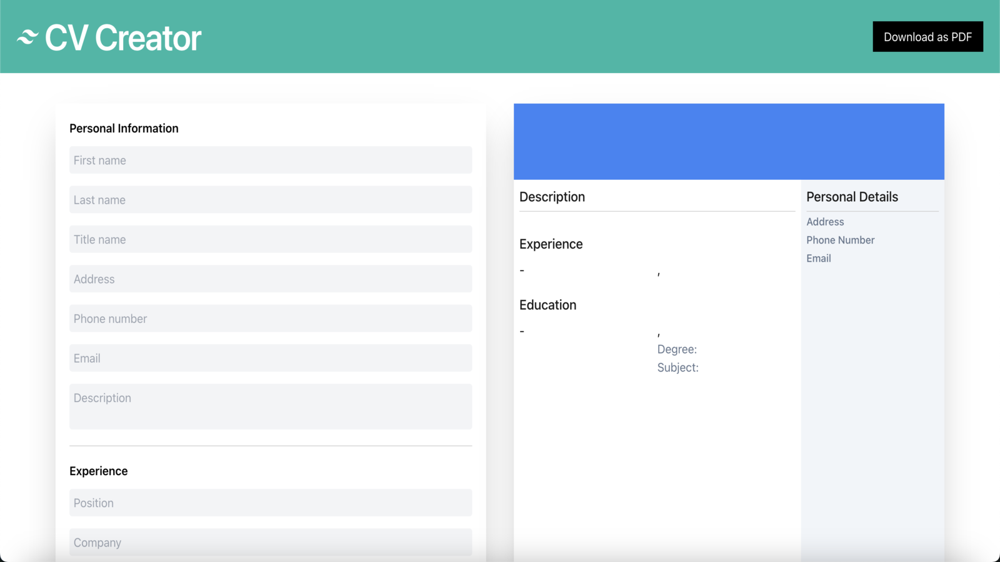
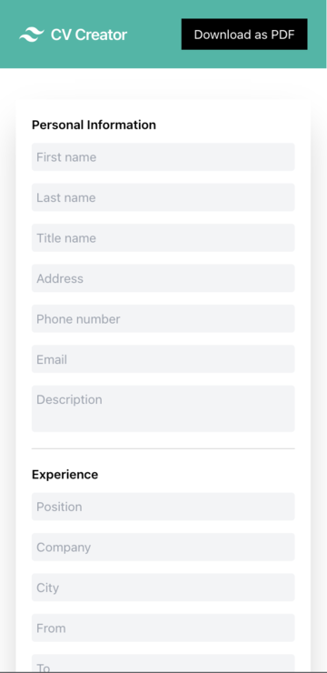

	<h1>CV Creator
	 
		
		
		
		
		
		 
	</h1>
	<h3><b><a href="https://hzk2021.github.io/cv-creator">View Live Demo</a></b></h3>

## Description

An app that allows users to create a customised résumé by displaying a live preview of the copy, and optionally download it in PDF format.

## Built Using

- React 
- JavaScript 
- Tailwind 
- Webpack 
- Babel 

## Preview

#### Desktop

#### Mobile

